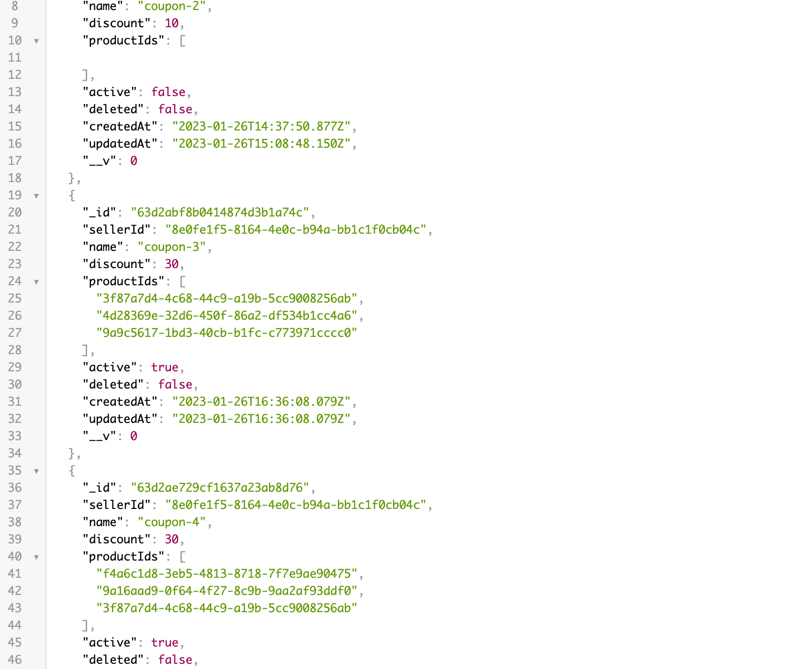

# coupon-api

## Summary

This API uses Node, Express, and MongoDB to create coupons for products.

**Product based Coupons**: Applied when one or more strictly specific products
are in the shopping cart.

**General Coupons**: Coupons that can be applied to any order, independently
from the existing items in shopping cart.

- [x] Create a Coupon (no duplicate names, active by default)
- [x] List all coupons by Seller Id (uuidv4)
- [x] Fetch a single coupon by its name
- [x] Update a coupon
- [x] Delete coupon
- [x] Validate the eligibility for a given coupon



## Installation

```
git clone

npm install
```

You'll need to set up a `.env` file and add in the following:

```
DB_PROD=YOUR_MONGODB_PROD_URL
DB_DEV=YOUR_MONGODB_DEV_URL
```

## MongoDB

To set up a test Database you can use MongoDB Atlas.

You can find more details here: https://www.mongodb.com/atlas

## Usage

To start the API you can run `npm start`

## Endpoints

The API consists of the following endpoints:

### Coupons

**GET /coupons**
Lists all coupons. You can also search for specific coupons using a query parameter.

```
name={name}
sellerId={sellerId}
```

**PUT /coupons/:id**
Updates any coupon by id. Takes an object with fields to update.

```
{
  active: Boolean,
  discount: Float
}
```

**POST /coupons**
Creates a new coupon.

```
{
  sellerId: {
    type: String,
    required: true,
  },
  name: {
    type: String,
    required: true,
    trim: true,
  },
  discount: {
    type: Float,
    min: 0,
    max: 100,
  },
  productIds: [
    {
      type: String,
      default: v4(),
    }
  ],
  active: {
    type: Boolean,
    default: true,
  },
}
```

**DELETE /coupons/:id**
Deletes a coupon by id. (soft delete)

**POST /coupons/validate**
Given a list of Seller ID’s, Product ID’s and a Coupon, this endpoint returns which products are eligible for the discount and how much discount the shopper should receive.

```
[
   {
     sellerId: 'xxxx-1111',
     products: ['xyz-456', 'zws-123'],
   },
   {
     sellerId: 'yyyy-2222',
     products: ['qwe-678', 'uyt-098', 'lkj-654'],
   },
]
```
